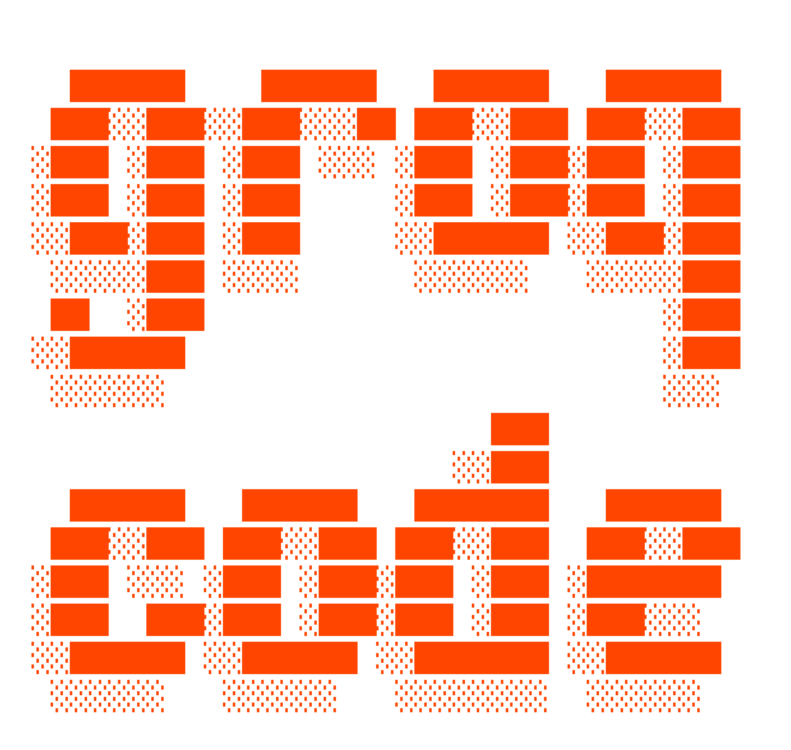

# Groq Code CLI

A TypeScript-based CLI tool powered by Groq's lightning-fast inference for interactive coding assistance. Built with React Ink for a modern terminal UI experience.



## TODO
>Please feel free to tackle any of these below and make a PR! It would greatly help me out.

- Stream tokens in src/ui/TokenMetrics.tsx
- Flags in cli.ts (e.g. --auto-write) haven't been updated in a while
- MCP
- Version control without Git: Checkpointing. Could create commits in a hidden, shadow repo that can be reverted to at any point.
- "New thread with summary" when hitting context limit
- GROQ.md support
- MAX mode/flag --max (uses lots of tokens)?
- Emojis are a little overkill and lead to buggy Ink rendering
- /login support to redirect users to https://console.groq.com/home for sign in, or enter API key
- /login API key storing will need to be updated to support installations via distribution
- Esc key to interrupt at any time
- More slash commands
- Markdown rendering. Tried a hacky workaround in utils/markdown.ts, but didn't quite work.
- Update lint code tool

- Prepare for distribution

## Installation

### For Developing

```bash
git clone https://github.com/groq/groq-code-cli.git
cd groq-code-cli
npm install
npm run build
npm link
npm run dev
```

### For End Users

```bash
...
```

## Usage

### Basic Usage

```bash
# Start interactive session
groq
```

### Command Line Options

```bash
groq [prompt] [options]

Options:
  -m, --model <model>           Model to use (default: moonshotai/kimi-k2-instruct)
  -t, --temperature <temp>      Temperature for generation (default: 0.7)
  -s, --system <message>        Custom system message
  --no-context                  Disable directory context
  --include-all                 Include config and documentation files
  -d, --directory <directory>   Directory to use as context (default: .)
  --auto-write                  Skip approval prompts and automatically execute tools
  -h, --help                    Display help for command
  -V, --version                 Display version number
```

### Authentication

On first use, you'll be prompted to enter your Groq API key:

```bash
groq
# Follow the login prompt to enter your API key
```

Get your API key from [Groq Console](https://console.groq.com/keys).

You can also set it via environment variable:
```bash
export GROQ_API_KEY=your_api_key_here
```

### Available Commands

Once running, you can use these slash commands:

- `/login` - Set or update your Groq API key
- `/help` - Show available commands

## Development

### Project Structure

...

### Available Scripts

```bash
npm run build      # Build TypeScript to dist/
npm run dev        # Build in watch mode
```

### Testing Locally

```bash
npm run build
npm link
npm run dev
```

## License

...

## Support

For issues and feature requests, please open an issue on GitHub.
